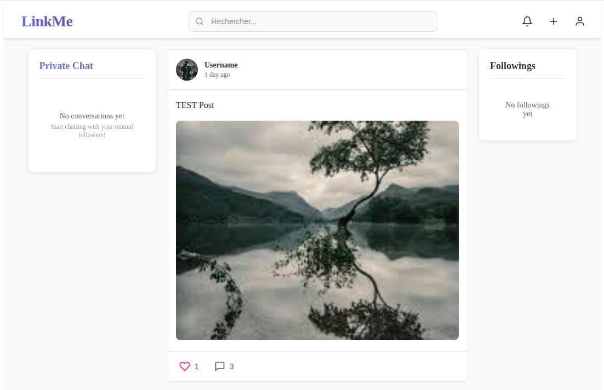

## 🚀 Project Overview
This project is a full-stack web application template that combines a modern backend and frontend stack with powerful
search capabilities using Elasticsearch and Kibana. It is designed to help developers quickly set up a robust development environment for building scalable web applications.

### ⚙️ Technologies Used
- **Symfony 7 + API Platform** as the backend (PHP 8.2).
- **Vue.js 3 + Vite + Vue Router + Vuex** as the frontend.
- **MySQL 8** as the database.
- **Elasticsearch 8** for search capabilities.
- **Kibana 8** for Elasticsearch visualization and management.
- **Docker & Docker Compose** for containerization.
- **Makefile** for automation (easy commands).
---

## 📂 Project Structure
```
.
├── backend/        # Symfony API Platform project
├── frontend/       # Vue.js frontend project
├── docker-compose.yml
├── Makefile
└── README.md
```

---

## ▶️ Pre-requires
```
- PHP >= 8.2 with extensions: `php-xml`, `php-cli`, `php-zip` and the `unzip` utility
- `git`
- `docker` and `docker-compose` (ensure Docker has enough memory for Elasticsearch)
- `composer`
- `node` and `npm` (required for frontend)
```
---

## ▶️ Running the Project

Start all services (backend, frontend, database, elasticsearch, kibana):
```bash
make up
```
Install backend and frontend dependencies:
```bash
make install
```
Create new user from registration page:
http://localhost:5173/register
Verify your email address before logging in http://localhost:8025.
---

## 🛠️ Services & Access

- **Symfony API Platform:** [http://localhost:8000/api](http://localhost:8000/api)
- **Vue.js Frontend:** [http://localhost:5173](http://localhost:5173)
- **Mailhog (for email testing):** [http://localhost:8025](http://localhost:8025)
- **MySQL Database (phpMyAdmin):** [http://localhost:8080](http://localhost:8080)
  - access with user `root` and password `root`
- **Elasticsearch:** [http://localhost:9200](http://localhost:9200)
- **Kibana:** [http://localhost:5601](http://localhost:5601)  
  Use Kibana to visualize and manage your Elasticsearch data.
---

## 🧹 Useful Commands & Notes

- Stop all services:
```bash
make stop
```
- Destroy all services and volumes (data loss):
```bash
make down
```
- Rebuild all services:
```bash
make rebuild
```
- View logs for all services:
```bash
make logs
```
- View logs for a specific service (e.g., backend):
```bash
make logs-backend
```
- Clear backend cache:
```bash
make clear-backend-cache
```


---

## 📝 Notes

- Ensure you have enough memory allocated for Docker to run Elasticsearch (at least 2GB recommended).
- The default configuration disables security for local usage. For production, review Elasticsearch security best practices.
- Kibana is automatically connected to Elasticsearch (see `docker-compose.yml`). Access the Kibana dashboard at [http://localhost:5601](http://localhost:5601).
- Use Kibana to create dashboards, view indexes, and interact with your Elasticsearch data.

---

## 📖 Next Steps

- Integrate Elasticsearch with your Symfony backend (e.g., using FOSElasticaBundle or ElasticSearch PHP client).
- Extend API Platform to support searching/filtering with Elasticsearch.